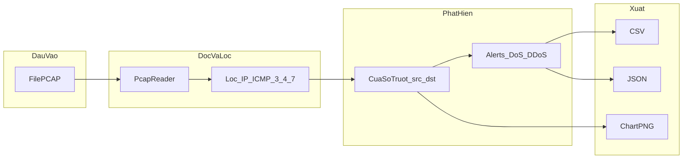

# Báo cáo Lab: Phân tích ICMP Flood với Wireshark và IDS

## Thông tin nhóm

| Thành viên | MSSV |
|---|---|
| Trần Minh Thắng | 2387700063 |
| Đặng Hải Tiến | 2387700067 |
| Bùi Quang Thiện | 2387700065 |

|================= prompt được viết tất cả trong folder openspec ======================|

## Vị trí tài liệu trong repo

- Bản báo cáo đầy đủ (file này): [`LAB_REPORT.md`](LAB_REPORT.md) trong thư mục `tools/`.
- Nếu cần tệp tên `Lab_report.md` ở thư mục gốc project: [`Lab_report.md`](../Lab_report.md) (mở nhanh hoặc dùng khi nộp bài theo đúng tên tệp).

## 1. Mục tiêu

- Phân tích luồng gói tin ICMP Type 3 Code 4 bằng Wireshark trong môi trường VMware
- Viết rule IDS (Snort/Suricata) để phát hiện flooding
- Tự động hóa phân tích file `.pcap` bằng Python

---

## 2. Môi trường Lab

| Thành phần | Giá trị |
|---|---|
| Hypervisor | VMware Workstation |
| Máy tấn công | Kali Linux — `192.168.56.64` |
| Máy nạn nhân | Windows — `192.168.56.63` |
| Công cụ capture | Wireshark ≥ 4.x |
| Công cụ phân tích | Python 3.10+, Scapy, pandas, matplotlib |

---

## 3. ICMP Types được giám sát

| Type | Code | Tên | Nguy cơ |
|---|---|---|---|
| 3 | 4 | Destination Unreachable – Fragmentation Needed | PMTUD Spoofing / Flood |
| 3 | 0–3 | Destination Unreachable (các variant) | DoS |
| 4 | 0 | Source Quench (deprecated RFC 6633) | Suspicious |
| 7 | 0 | Unassigned / Reserved | Highly suspicious |

---

## 4. Quy trình thực hiện

### Bước 1: Capture traffic trên Wireshark (Kali Linux)

```bash
# Lọc real-time trên Wireshark
icmp.type == 3 && icmp.code == 4

# Hoặc capture toàn bộ ICMP
icmp
```

Lưu file: `File → Export Specified Packets → capture.pcap`

### Bước 2: Phân tích bằng Python

```bash
# Cài dependencies (chỉ 1 lần)
pip install -r tools/requirements_lab.txt

# Sinh PCAP test (nếu chưa có file thật)
python tools/gen_test_pcap.py

# Phân tích và xuất toàn bộ báo cáo
python tools/pcap_analyzer.py test_capture.pcap --all -o output/report
```

### Bước 3: Đọc kết quả

| File output | Nội dung |
|---|---|
| `output/report_alerts.csv` | Danh sách các sự kiện flood |
| `output/report_packets.csv` | Toàn bộ packets ICMP 3/4/7 |
| `output/report_report.json` | JSON đầy đủ với metadata |
| `output/report_chart.png` | Biểu đồ timeline + top IPs |

---

## 5. Cơ chế hoạt động của công cụ `pcap_analyzer.py`

Script [`pcap_analyzer.py`](pcap_analyzer.py) đọc file capture Wireshark (`.pcap` / `.pcapng`) hoặc chạy giám sát trực tiếp trên card mạng, rồi trích các gói ICMP “có rủi ro”, gom theo thời gian và so với ngưỡng để báo động flood (DoS một nguồn hoặc DDoS nhiều nguồn).

### 5.1. Đọc PCAP (offline)

- Dùng `scapy.utils.PcapReader` theo **luồng (streaming)**: duyệt từng gói, không cần nạp toàn bộ file vào bộ nhớ một lần — phù hợp file capture lớn.
- Với mỗi gói: chỉ xử lý nếu có lớp **IP** và **ICMP**.
- Lọc `icmp.type` thuộc tập **3, 4, 7** và `icmp.code` nằm trong bảng `ICMP_TYPES_OF_INTEREST` trong mã nguồn (ví dụ Type 3 Code 4 = PMTUD / fragmentation needed; Type 4 Code 0 = Source Quench đã deprecated; Type 7 = reserved).
- Mỗi dòng dữ liệu nội bộ gồm: `timestamp`, `src_ip`, `dst_ip`, `icmp_type`, `icmp_code`, `length`.

### 5.2. Phát hiện flood (offline): cửa sổ trượt

- Tham số **`--threshold` / `-t`**: số gói tối thiểu trong cửa sổ (mặc định **100** pkt/s nếu `--window` = 1).
- Tham số **`--window` / `-w`**: độ dài cửa sổ thời gian tính bằng **giây** (mặc định **1**).
- **DoS một nguồn**: gom gói theo khóa `(src_ip, icmp_type, icmp_code)`, sắp theo thời gian, dùng hai chỉ số **cửa sổ trượt** (`left` / `right`) để đếm số gói có timestamp nằm trong khoảng `window` giây; nếu `count >= threshold` thì ghi nhận cảnh báo **Single-Source DoS** (kèm `pps`, thời điểm bắt đầu/kết thúc cửa sổ).
- **DDoS nhiều nguồn → một đích**: gom theo `dst_ip`, cùng cơ chế cửa sổ; ngưỡng tổng gói trong cửa sổ là **`1.5 × threshold`**; nếu trong cửa sổ có **hơn một** `src_ip` khác nhau thì ghi nhận **Distributed DoS (DDoS)**.

### 5.3. Thống kê và xuất file

- Hàm `summarize`: đếm số gói theo từng **IP nguồn** và theo từng cặp **Type_Code**.
- Tiền tố **`--output` / `-o`** (không cần phần mở rộng): sinh các tệp cùng thư mục với tên dạng `{stem}_alerts.csv`, `{stem}_packets.csv`, `{stem}_report.json`, `{stem}_chart.png`.
- **`--csv`**, **`--json`**, **`--chart`**, hoặc **`--all`**: chọn định dạng xuất (chỉ áp dụng chế độ offline).

### 5.4. Biểu đồ

- Cần **matplotlib** (và **pandas** nếu có) để vẽ PNG.
- Trục thời gian: gom số gói ICMP theo **1 giây** (resample), vẽ đường + vùng tô; có đường ngưỡng mặc định 100 pkt/s.
- Biểu đồ thứ hai: **top 10 IP nguồn** theo tổng số gói (màu phân biệt IP vượt ngưỡng).

### 5.5. Chế độ giám sát trực tiếp (`--live`)

- Gọi `sniff(filter="icmp", store=False, prn=...)` để không tích lũy toàn bộ gói trong RAM.
- Lớp **`LiveDetector`**: giữ danh sách gói gần đây trong phạm vi `window` giây (thời gian thực), định kỳ dọn gói cũ; có **cooldown** in console để tránh spam log.
- Logic phân biệt DoS (một `src` vượt ngưỡng) / DDoS (nhiều `src` cùng nhắm một `dst`, tổng gói vượt `1.5 × threshold`) tương tự ý tưởng offline nhưng trên luồng thời gian thực.
- Có thể chỉ định card bằng **`-i` / `--interface`**; chạy sniff thường cần quyền **administrator / root**.

### 5.6. PCAP mẫu [`gen_test_pcap.py`](gen_test_pcap.py)

- Sinh `test_capture.pcap` với nhiều đoạn: nền thấp, burst DoS Type 3 Code 4, burst Type 4, đoạn DDoS giả lập nhiều IP botnet, và traffic hồi phục — để kiểm thử đầy đủ pipeline phân tích.

Luồng xử lý tổng quát (offline):



---

## 6. IDS Rules (Snort/Suricata)

### Snort

```snort
alert icmp any any -> $HOME_NET any (
    msg:"[LAB-IDS] ICMP Type 3 Code 4 Flood - PMTUD Attack";
    itype:3; icode:4;
    detection_filter: track by_src, count 100, seconds 1;
    classtype:attempted-dos; priority:1;
    sid:9000001; rev:1;
)
```

### Suricata

```yaml
alert icmp any any -> $HOME_NET any (
    msg:"[LAB-IDS] ICMP T3C4 Flood from Single Source";
    itype:3; icode:4;
    threshold: type threshold, track by_src, count 100, seconds 1;
    classtype:attempted-dos; priority:1;
    sid:9000002; rev:1;
)
```

---

## 7. Kết quả mong đợi

Khi file `test_capture.pcap` được phân tích:

- **Ít nhất hai cảnh báo Single-Source DoS** (tùy cấu hình có thể thêm cảnh báo DDoS từ đoạn botnet trong PCAP mẫu), ví dụ:
  - `192.168.56.64` (Kali trong `gen_test_pcap.py`) → ICMP Type 3 Code 4 — ~200 pkt/s (vượt ngưỡng 100)
  - `192.168.56.102` → ICMP Type 4 Code 0 — ~125 pkt/s (vượt ngưỡng 100)
- **Biểu đồ** hiển thị spike rõ ràng tại giây thứ 6 và 10

---

## 8. Công cụ và Files

```
tools/
├── pcap_analyzer.py      ← Script phân tích chính
├── gen_test_pcap.py      ← Sinh PCAP mẫu để test
├── install_lab.bat       ← Cài dependencies (Windows)
└── requirements_lab.txt  ← Danh sách thư viện
```
